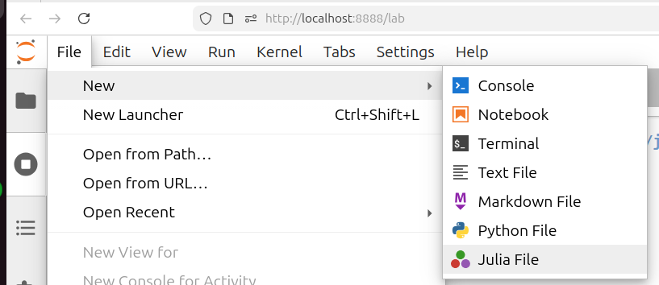
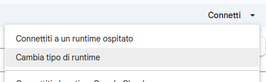
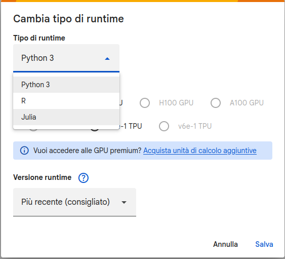

# Materiale su Julia per il Laboratorio di Introduzione alla Matematica Computazionale

Questo repository contiene materiale didattico e risorse per il corso di Laboratorio di Introduzione alla Matematica Computazionale, con un focus particolare sul linguaggio di programmazione Julia.

## Ottenere Julia

Per iniziare a utilizzare Julia, è necessario prima installarla sul proprio computer. La procedure è leggermente
diversa a seconda del sistema operativo in uso.

### Windows

È possibile installre Julia su Windows eseguendo il seguente comando in PowerShell:

```powershell
winget install --name Julia --id 9NJNWW8PVKMN -e -s msstore
```

Questo installerà l'ultima versione stabile di Julia e juliaup, che vi permetterà di aggiornare Julia facilmente in futuro.

Dopo l'installazione, potete avviare Julia digitando `julia` nella powershell.

> [!TIP]
> Potete seguire le istruzioni per Linux/MacOS anche su Windows, è sufficiente che eseguiate i comandi all'interno del
> Windows Subsystem for Linux (WSL), che oramai dovreste avere installato. In questo modo avrete un ambiente di sviluppo
> simile a quello che si trova su Linux, e potrete seguire le stesse istruzioni per l'installazione di JupyterLab.
> Se non avete ancora installato WSL, potete farlo seguendo le istruzioni sul [sito ufficiale di Microsoft](https://docs.microsoft.com/en-us/windows/wsl/install).


### Linux/MacOS

Su Linux (e MacOS) potete installare Julia utilizzando il seguente comando nel terminale:

```bash
curl -fsSL https://install.julialang.org | sh
```

Questo script scaricherà e installerà l'ultima versione stabile di Julia e juliaup, che vi permetterà di aggiornare Julia facilmente in futuro.

Dopo l'installazione, potete avviare Julia digitando `julia` nel terminale.

## Jupyter Notebooks

Gli esempi riportati in questo repository sono in formato Jupyter Notebook. Potete seguire questi notebook utilizzando JupyterLab o Jupyter Notebook, oppure visualizzarli direttamente su GitHub e replicando i comandi nella vostra installazione di Julia.

Per installere JupyterLab, la procedura è di nuovo leggermente diversa tra Windows e Linux.

### Windows

In primo luogo avete bisogno di **avere Python e pip** installati sul vostro sistema Windows. Se non li avete ancora, potete installare Python dal [sito ufficiale di Python](https://www.python.org/downloads/windows/). Il software pip può essere
poi installato seguendo le istruzioni sul [sito ufficiale di pip](https://pip.pypa.io/en/stable/installation/).

Su Windows, potete installare JupyterLab utilizzando pip:

```powershell
pip install jupyterlab
```

Per abilitare il kernel Julia in JupyterLab, dovete installare il pacchetto `IJulia` da Julia. Aprite Julia e eseguite:

```julia
using Pkg
Pkg.add("IJulia")
```

Questo installerà automaticamente il kernel Julia per Jupyter. Dopo l'installazione, potete avviare JupyterLab digitando nella PowerShell:

```powershell
jupyter lab
```

Quando create un nuovo notebook, troverete Julia disponibile tra i kernel disponibili:
- 

### Linux/MacOS

Python è spesso già installato su Linux e MacOS, ma se non lo avete, potete installarlo utilizzando il gestore di pacchetti del vostro sistema (ad esempio `apt` su Ubuntu o `brew` su MacOS). Una volta che Python è installato, potete installare pip seguendo le istruzioni sul [sito ufficiale di pip](https://pip.pypa.io/en/stable/installation/). 


Su Linux e MacOS, potete installare JupyterLab utilizzando pip all'interno di un Virtual Environment:

```bash
python3 -m venv jupyterlab-env
source jupyterlab-env/bin/activate
pip install jupyterlab
```

Per abilitare il kernel Julia in JupyterLab, dovete installare il pacchetto `IJulia` da Julia. Aprite Julia e eseguite:

```julia
using Pkg
Pkg.add("IJulia")
```

Questo installerà automaticamente il kernel Julia per Jupyter. Dopo l'installazione, potete avviare JupyterLab digitando nel terminale:

```bash
jupyter lab
```

Quando create un nuovo notebook, troverete Julia disponibile tra i kernel disponibili:
- 

## Online tramite Google Colab

Se non volete installare nulla sul vostro computer, potete eseguire i notebook direttamente online utilizzando [Google Colab](https://colab.research.google.com/). Per farlo, basta aprire il link, fare login con il vostro account di ateneo ed inserire
l'url di questo repository:

```plaintext
https://github.com/limco-unipisa/lezioni-julia
```

In questo modo potrete eseguire i notebook direttamente dal vostro browser, senza dover installare nulla.

Se volete creare un nuovo notebook, potete farlo cliccando su:
1. "File" > "Nuovo Notebook"
2. Freccia verso il basso vicino a "Connetti" > "Cambia tipo di runtime" > "Julia"
   - 
   - 
3. Cliccare su "Salva" e poi su "Connetti" per avviare il runtime Julia.

In questo modo avrete un ambiente di sviluppo completo per eseguire i notebook di questo repository direttamente online, senza dover installare nulla sul vostro computer.
